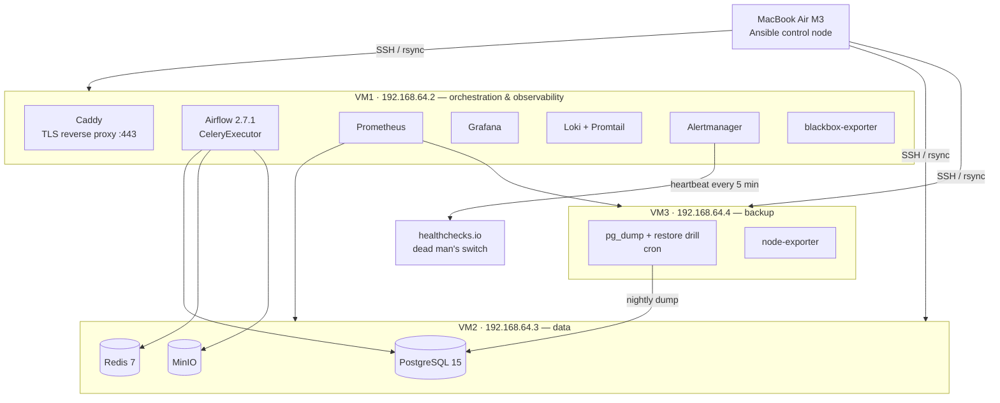

# Mini DataOps Platform

A three-node data platform I run on my own hardware — Airflow pipelines, PostgreSQL,
MinIO, and a full observability stack — built to practise the operational side of
infrastructure work: reproducible provisioning, hardening, backup you can actually
restore, and alerts that have been proven to fire.

Everything runs on three Ubuntu 22.04 ARM64 VMs under UTM on a MacBook Air M3.

## What has been verified

Numbers below are measured on the running system, not estimates. Each one has a
repeatable procedure in [docs/chaos-drills.md](docs/chaos-drills.md).

| Capability | Evidence |
|---|---|
| Rebuild a node from nothing | Wiped all containers, images and code on VM3 → **28 s** to full service via one playbook |
| Configuration converges | `site.yml` second run: **`changed=0`** on all three hosts |
| Database restore | Restored a nightly backup into a fresh database → **2 s**, 49 tables, row counts intact |
| Backup is actually restorable | Weekly automated drill restores both the database and the object store; a deliberately corrupted archive is detected and fails the job |
| Data lake restore | Nightly MinIO archive replayed into a blank instance → **17/17 objects**, md5 identical, under 1 s |
| Monitoring-of-the-monitoring | Stopped Alertmanager for 17 min → external dead man's switch emailed after **14.5 min** |
| Alert noise is controlled | Injected a host-down alert: every other alert for that host moved to `suppressed`, while the same alert on a different host stayed `active` |
| Alerts are unit-tested | `promtool test rules` replays synthetic metrics in CI; reverting a threshold bug that made one alert unreachable turns the suite red |
| Silent worker death is caught | Reproduced the 25.5 h incident (worker alive, answering pings, not consuming) → alert fired and paged in **11.5 min** |
| Services survive reboot | Removed every container, rebooted the host → systemd brought the stack back with no manual step |
| Dashboards survive volume loss | Deleted the Grafana volume → datasources and dashboards restored from files in this repo |
| Deployment is not network-bound | Airflow cold start cut from **419 s → 17 s** by baking dependencies into a pinned image |

## Architecture



Every web UI sits behind Caddy on port 443 with certificates from its internal CA.
VM1 exposes only 22, 80 and 443; the HTTP ports of Grafana, Prometheus, Airflow and
the exporters are not published at all.

## Stack

| Layer | Choice |
|---|---|
| Orchestration | Apache Airflow 2.7.1, CeleryExecutor on Redis |
| Storage | PostgreSQL 15, MinIO (S3-compatible) |
| Metrics | Prometheus, node-exporter, cAdvisor, postgres-exporter, blackbox-exporter |
| Logs | Loki + Promtail, 7-day retention |
| Alerting | Alertmanager → ntfy, plus healthchecks.io as dead man's switch |
| TLS | Caddy with internal CA, hostname routing on `*.dataops.test` |
| Provisioning | Ansible — 9 roles, secrets in Ansible Vault |
| CI/CD | GitHub Actions; self-hosted runner on VM1 |
| Tests | 66 pytest cases, flake8, yamllint, ansible-lint (production profile), shellcheck, hadolint |

## Repository layout

```
infra/ansible/     9 roles, site.yml, host_vars, vault
docker/            compose per VM + Dockerfile for the Airflow image
monitoring/        Prometheus rules, Grafana dashboards, Loki, Caddy, blackbox
pipeline/          ETL modules, Airflow DAGs, 66 unit tests
backup/            nightly dump + weekly restore verification
docs/              runbooks, postmortems, DR plan, chaos drills
```

## Getting started

Control node needs Ansible, the collections in `infra/ansible/requirements.yml`,
and GNU rsync (`brew install rsync` — the macOS build cannot report changes, which
makes every run look changed).

```bash
cd infra/ansible
ansible-galaxy collection install -r requirements.yml
ansible all -m ping
ansible-playbook site.yml --ask-become-pass      # vm2 → vm1 → vm3
```

Point the internal hostnames at VM1 to reach the web UIs:

```bash
sudo sh -c 'cat >> /etc/hosts' <<'EOF'
192.168.64.2  grafana.dataops.test airflow.dataops.test prometheus.dataops.test
192.168.64.2  alerts.dataops.test flower.dataops.test cadvisor.dataops.test
EOF
```

| Service | URL |
|---|---|
| Airflow | https://airflow.dataops.test |
| Grafana | https://grafana.dataops.test |
| Prometheus | https://prometheus.dataops.test |
| Alertmanager | https://alerts.dataops.test |

## Operations

Each stack is a systemd unit, so nothing needs to be started by hand after a reboot:

```bash
sudo systemctl status dataops-airflow dataops-monitoring   # VM1
sudo systemctl status dataops-database                      # VM2
```

Backups run nightly at 02:00 on VM3 and produce two files — the database dump and
the role definitions. The second one exists because `pg_dump` does not include
roles, which is why four months of backups turned out to be unrestorable
([postmortem](docs/postmortems/01-backup-khong-restore-duoc.md)).

A restore drill runs every Sunday: it starts a throwaway PostgreSQL, restores into
it, counts tables and rows, then tears it down. Its result becomes a Prometheus
metric, so a broken backup raises an alert instead of sitting silently in a log.

## Alerting

20 rules, each carrying a `runbook_url` that points at a specific procedure in
[docs/runbooks/](docs/runbooks/) — the person paged at 2 a.m. gets instructions, not
just a red dot.

`Watchdog` is the odd one out: it is always firing by design. Alertmanager forwards
it to healthchecks.io every five minutes, and that service alerts when the heartbeat
stops. Without it, an outage of the monitoring stack is invisible — which is exactly
what happened on 15 Sep 2026, when Alertmanager went silent for 15 minutes and
nothing reported it.

## Security

| Area | State |
|---|---|
| SSH | Key-only, root login disabled, fail2ban |
| Firewall | UFW declared per host in `host_vars/`, default deny inbound |
| Secrets | Ansible Vault; `.env` rendered per host, each host gets only what it needs |
| TLS | All web UIs behind Caddy; plain HTTP ports removed from compose |
| Redis | Password required — it was previously open on the lab network |
| Git history | Rewritten to remove credentials; every password that ever appeared has been rotated |

UFW does not protect ports published by Docker — Docker inserts its own iptables
rules ahead of it. That was verified rather than assumed, and the fix was to stop
publishing ports that nothing outside needs.

## What I learned the hard way

Six incidents are written up in [docs/postmortems/](docs/postmortems/). They share
a theme: **the system reported healthy while it was broken**.

| Incident | Hidden for |
|---|---|
| Backups that could not be restored | 4 months |
| Prometheus serving a stale rules file because Docker binds single files by inode | hours |
| CD silently failing on three consecutive pushes | 3 pushes |
| Three VMs dying from RAM overcommit (24 GB allocated on a 16 GB host) | hours |
| A Celery worker that answered every health check while it had stopped consuming work | 25.5 hours |
| The first CD run after a 3-day runner outage deleted the Alertmanager config; Docker then mounted a directory in its place | 1.5 min (caught by blackbox probe) |

Three of the four only surfaced because someone went looking at something everyone
assumed was fine.

## Known limitations

Written down deliberately — a system is only trustworthy if its gaps are known:

- **MinIO backups live on the same lab network.** Objects are mirrored nightly from VM2 to VM3 and
  archived there, so losing the `minio_data` volume is recoverable, but losing the laptop is not.
- **Backups live on the same physical machine as the data.** Losing the laptop loses both.
- **The vault password exists only on the control node.**
- **OS installation is manual**, which dominates the recovery time in the worst case.
- **Airflow still uses its default admin account**, and Airflow metadata shares a
  database with pipeline data.
- **RAM allocation exceeds physical memory** and has not yet been right-sized.

## Documentation

| Document | Contents |
|---|---|
| [docs/dr-plan.md](docs/dr-plan.md) | RPO/RTO, four recovery scenarios, gap analysis |
| [docs/chaos-drills.md](docs/chaos-drills.md) | 12 drills actually run, with commands to repeat them |
| [docs/runbooks/](docs/runbooks/) | One procedure per alert |
| [docs/postmortems/](docs/postmortems/) | Six incident write-ups |
| [docs/README.vi.md](docs/README.vi.md) | Vietnamese operating guide |
